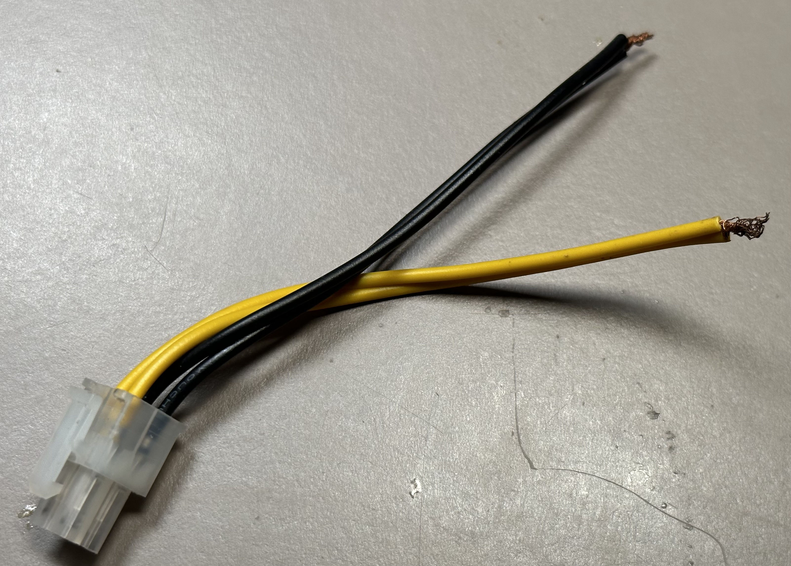
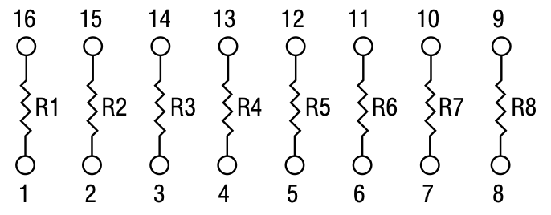

# Table of contents

1. [Introduction](#introduction)
1. [Todo](#todo)
1. [Powered-off Testing](#powered-off-testing)
    1. [Test Setup](#test-setup)
    1. [Always-on 5V](#always-on-5v)
    1. [1.2V Reference](#12v-reference)
    1. [A/D Line](#ad-line)
1. [Powered-on Testing](#powered-on-testing)
    1. [Test Setup](#test-setup-1)
    1. [Powered-on +5V](#powered-on-5v)
    1. [Disk +12V](#disk-12v)
    1. [Disk +5V](#disk-5v)
1. [Additional Testing](#additional-testing)
    1. [-5V](#5v)
    1. [Charge Detection](#charge-detection)
    1. [Low Voltage Cutoff](#low-voltage-cutoff)
    1. [External video +5V](#external-video-5v)
    1. [Battery Compartment/Switch](#battery-compartmentswitch)
1. [Troubleshooting](#troubleshooting)
    1. [Always-on +5V Troubleshooting](#always-on-5v-troubleshooting)
    1. [1.2V Reference Troubleshooting](#12v-reference-troubleshooting)
    1. [A/D Line Troubleshooting](#ad-line-troubleshooting)
    1. [Powered-on +5V Troubleshooting](#powered-on-5v-troubleshooting)
    1. [Disk +12V Troubleshooting](#disk-12v-troubleshooting)
    1. [Disk +5V Troubleshooting](#disk-5v-troubleshooting)
1. [Additional Resources](#additional-resources)

# Introduction
The goal of this document is to be an in-depth testing and troubleshooting guide for the Macintosh Portable M5120, and eventually the later backlit model M5126.

This is still heavily a work in progress, so many sections are completely empty.

# ToDo

- Finish most of the document
- Pictures and diagrams
- Seperate M5126 section?
- Make things look better
- Interactivity

## Before you begin

# Powered-off Testing

## Test Setup
For the initial testing while powered off, disconnect everything down to the bare logic board.

You will need the following:
- The main logic board
- A method of connecting power to *both* battery input pins
- A suitable power source

### Connecting to the battery input

#### Using a 4-pin connector
The easiest way is to use a 4-pin power connector like the ones found on an ATX power supply. These are also commonly called "ATX 12V" or "CPU power" connectors.  
You can cut one off an ATX power supply, or buy a 4-pin extender cable commonly avaiable on places like Amazon, eBay, or other online and local computer stores.

#### Clipping on to the board

#### Using the battery box
Using the original battery box and casing is probably the most difficult method of testing, as the large box tends to get in the way.

Before attempting to use the battery box in this way, I recommend [testing the switch](#battery-compartmentswitch).
### Supplying power
When testing with the computer powered off, we don't need much power.

Start with around 6.0V 500mA. This is to reduce the chance of damaging the A/D line due to bad circuity on the hybrid.  
This voltage should be sufficient to run most systems, but you can increase the voltage to 6.5V if you have trouble.

## Always-on +5V

## 1.2V Reference

## A/D Line

# Powered-on Testing

## Test Setup

## Powered-on +5V

## Disk +12V

## Disk +5V

# Additional Testing

## -5V

## Charge Detection

## Low Voltage Cutoff

## External Video +5V

## Battery Compartment/Switch
First off, make sure you know which is the positive and negative terminals on the battery compartment, 9V battery, and 4-pin plug.

With the battery cover off and the switch un-depressed, 

# Troubleshooting

## Always-on +5V Troubleshooting

### No voltage
Issue: No voltage is found on the always-on 5V source.

#### Fuse

#### Q16 Source

#### Q16 Gate

#### +5V Op-amp

### Low voltage
Issue: The always-on +5V is lower than 4.9V.

### High voltage
Issue: The always-on +5V is greater than around 5.4V, or is the same voltage as the battery.

## 1.2V Reference Troubleshooting

## A/D Line Troubleshooting

## Powered-on +5V Troubleshooting

## Disk +12V Troubleshooting

## Disk +5V Troubleshooting

## -5V Troubleshooting

# Additional Resources

## Hybrid Pinout and Readings

| Pin | Description | Nominal Voltage |
| --- | --- | --- |
| 8 | [+5V Regulation](#5v-regulation) | |
| 11 | +5V | |
| 16 | | |
| 17 | | |
| 18 | +5V | |
| 19 | | |
| 22 | | |
| 25 | | |
| 29 | | |
| 31 | | |
| 33 | -5V | 0V or -5V |
| 37 | -5V Enable | |
| 38 | | 0V |
| 39 | | |
| 40 | | |
| 41 | | |
| 51 | 1.2V Reference | 1.23V |
| 52 | | |
| 62 | [A/D](#ad) | 1V to 5V |

## Hybrid Extended Information

### +5V Regulation

### +5V

### Pin 16

### Pin 17

### Pin 19

### Pin 22

### Pin 25

### Pin 29

### Pin 31

### -5V

### -5V Enable

### Pin 38

### Pin 39

### Pin 40

### Pin 41

### 1.2V Reference

### Pin 52

### A/D

## M5126 RP201 Resistor Network

Appears as Bourns 4816P-E41-000 or Dale 112S0600

Layout is an isolated resistor network.

Values:  
R1 430k  
R2 360k  
R3 1.37k  
R4 845k  
R5 320k  
R6 100k  
R7 100k  
R8 100k

## Full Component List

| Designator | Location | Part | Description | Schematic Page |
| --- | --- | --- | --- | --- |
| C19 | | | Capacitor for LT1054 on hybrid | 14 |
| R21 | | 100k Ω 1206 Resistor | +12V on/off pull-up | 14 |
| R24 | | 301k Ω 1206 Resistor | SCSI +5V voltage divider |
| R25 | | 100k Ω 1206 Resistor | SCSI +5V voltage divider |
| R50 | | 10k Ω 1206 Resistor | /IPL1 pull-up | 3 |
| R94 | | 100k Ω 1206 Resistor | /LW pull-up | 5 |
| R95 | | 100k Ω 1206 Resistor | Permanent RAM /CS15 pull-up | 15 |
| R112 | | 100k Ω 1206 Resistor | /SLOT_LW pull-up | 5 |
| R113 | | 100k Ω 1206 Resistor | /SLOT_UW pull-up | 5 |
| R116 | | 100k Ω 1206 Resistor | /UW pull-up | 5 |
| R120 | | 100k Ω 1206 Resistor | ROM /OE pull-up | 4 |
| R129 | | 10k Ω 1206 Resistor | /BERR pull-up | 3 |
| R130 | | 10k Ω 1206 Resistor | /BGACK pull-up | 3 |
| R131 | | 10k Ω 1206 Resistor | /BR pull-up | 3 |
| R135 | | 100k Ω 1206 Resistor | Video RAM /RW pull-up | 6 |
| R136 | | 100k Ω 1206 Resistor | Video RAM /CS pull-up | 6 |
| R138 | | 100k Ω 1206 Resistor | /IPL2 pull-down | 3 |
| R160 | | 75k Ω 1206 Resistor | 1.2V reference to SCSI +5V OpAmp | 14 |
| RP2 | | | Permanent RAM /CS pull-ups | 15 |
| Q1 | | IRF9Z30 | | |
| Q2 | | IRFR9020 | Serial +5V on/off | 8 |
| Q4 | | IRFR9020 | External video +5V on/off | 6 |
| Q14 | | IRF9Z30 | | 14 |
| Q15 | | IRF9Z30 | | 14 |
| Q16 | | IRF9Z30 | +5V regulator |
| Q20 | | IRF9Z30 | SCSI +5V regulator |
| Q21 | | IRFR9020 | +12V on/off |
| U5D | | 74AC245 | Permanent RAM data bus transceiver | 4 |
| U5E | | 74AC245 | Permanent RAM data bus transceiver | 4 |
| U5F | | 27C101 | Hi ROM | 4 |
| U5G | | 27C101 | Lo ROM | 4 |
| U7M | | OP-20 | SCSI +5V OpAmp | 14 |
| U10D | | | CPU GLU | 5 |
| U11C | | 74AC244 | | 3 |
| U12C | | 74AC244 | | 3 |
| U12D | | 68HC000 | | 3 |
| U15D | | | Video | 6 |
| VR1 | | | | 14 |