## Main ICs

### CPU - 68HC000

Designator: U12D

Package: PLCC-68

Type: Motorola 68HC000 16MHz

Part Number: MC68HC000FN12F

### CPU GLU

Also known as: CPU CAD, Coarse Address Decode, Normandy

Designator: U10D

Package: PLCC-84

Type: Custom VLSI ASIC

Apple Part Number: 344S0608-02

See also: [CPU GLU](CPUGLU.md)

### MISC GLU

Also known as: Fine Address Decode

Designator: U12G

Package: PLCC-84

Type: Custom VLSI ASIC

Apple Part Number: 34460610-1

### VIA

Designator: U14J

Package: 

Type: 

### VIDEO

Also known as: Omaha

Designator: U15D

Package: PLCC-84

Type: Custom VLSI ASIC

Apple Part Number: 344S0609-01

### Power Manager

Type: Mitsubishi M50753 Microcontroller

Apple Part Number: 342S0753-A

### 85C30

Designator: U10H

### Keyboard Controller

Designator: U12K

Apple Part Number: 342S0740-2

### SCSI

Designator: 

Type: 53C80

### SWIM

Apple Part Number: 344S1029

### ASC

Apple Part Number: 344S0063-1

## Other ICs

### SRAM (M5120 only)

### PSRAM (M5126 only)

### Video RAM

## Hybrid (M5120 only)

## Connectors

### RAM and ROM Connectors

Designator: J10, J11

Part Number: TE Connectivity AMPMODU 5-534978-8 (Compatible)

### PDS Connector

Designator: J12

### Modem Connector

Designator: J9

### Battery Connector

Designator: J17

Part Number: Molex Mini-Fit Jr. 39-28-1043

Mating Connector: Molex Mini-Fit Jr. 39-01-2040

### SCSI Connector

Designator: J18

### Keyboard/Trackball Connectors

## Capacitors

### Electrolytic Capacitors

**C16**

### Tantalum Capacitors

### Ceramic Capacitors

## Resistors

#### RP201

Appears as Bourns 4816P-E41-000 or Dale 112S0600

Layout is an isolated resistor network.

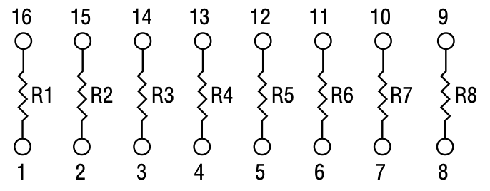{ width="160px" }

Values:  
R1 430k  
R2 360k  
R3 1.37k  
R4 845k  
R5 320k  
R6 100k  
R7 100k  
R8 100k

## Transistors

## Diodes

## Inductors

## Other Components

## Parts/Assemblies

### Boards and Cards

#### 661-0468 - Modem, 2400, Portable, Internal, U.S.
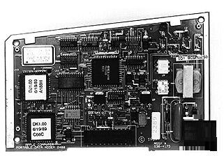{ width="160px" }
#### 661-0470 - Board, Logic, Static RAM
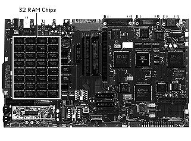{ width="160px" }
#### 661-0480 - Card, Static RAM, 1MB
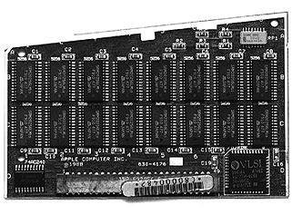{ width="160px" }
#### 661-0648 - Card, ROM, Backlit Upgrade
#### 661-1610 - Board, Logic, Pseudostatic RAM
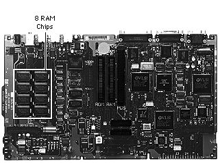{ width="160px" }
#### 661-1613 - Card, PSRAM, 3 MB
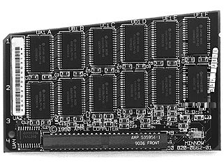{ width="160px" }
#### 661-1614 - Card, PSRAM, 1 MB
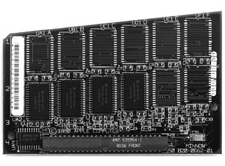{ width="160px" }
#### 699-0515 - Invertor PCA, Lightweight

### Cables

#### 590-0501 - Cable, Apple SuperDrive to Logic Board
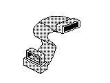{ width="160px" }
#### 590-0502 - Cable, Display, Original Portable
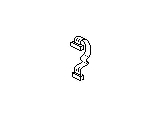{ width="160px" }
#### 590-0507 - Cable, Keyboard / Trackball / Numeric Keypad to Logic Board
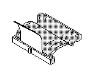{ width="160px" }
#### 590-0552 - Cable, Mini DIN-8, 2 M, Smoke
#### 590-0590 - Cable, Telephone
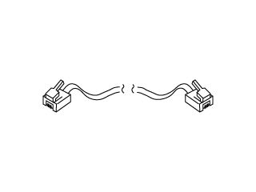{ width="160px" }
#### 600-0425 - Wire Harness, 9 V
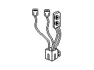{ width="160px" }
#### 630-6280 - Cable, Display, Backlit Portable
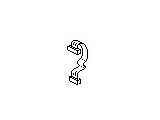{ width="160px" }
#### 630-6387 - Cable, Display, Backlit Upgrade

### Case

#### 630-5071 - Case, Handle
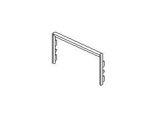{ width="160px" }
#### 630-5418 - Case, Bottom (replaced by 630-5844)
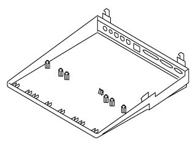{ width="160px" }
#### 630-5574 - Case, Carrying
#### 630-5684 - Subframe
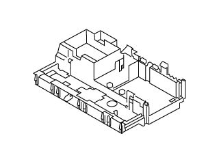{ width="160px" }
#### 630-5687 - Cover, Rear
#### 630-5723 - Battery Cover
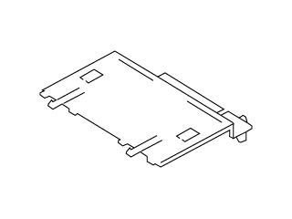{ width="160px" }
#### 630-5844 - Case, Bottom, Lightweight
{ width="160px" }
#### 652-0604 - Housing, Display, Original (replaced by 652-0605)
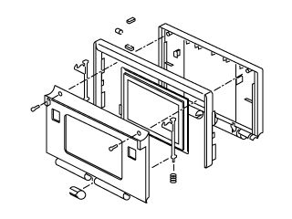{ width="160px" }
#### 652-0605 - Housing, Display, Backlit Portable
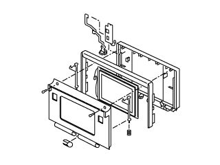{ width="160px" }
#### 699-0508 - Strap, Carrying Case
#### 699-5070 - Clutch
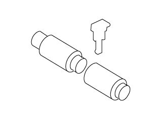{ width="160px" }
#### 805-0961 - Carrier, 1.4 MB Apple SuperDrive
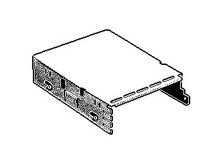{ width="160px" }
#### 805-0973 - Gasket, Foam, RFI
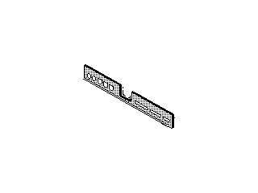{ width="160px" }
#### 805-0976 - Gasket, RFI, Modem
#### 805-1120 - Spring, Latch
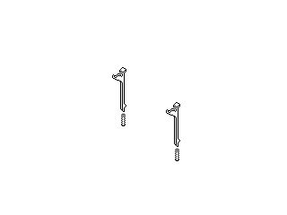{ width="160px" }
#### 805-5050 - Carrier, 800K / SuperDrive
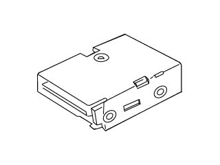{ width="160px" }
#### 815-1059 - Cover, Keyboard
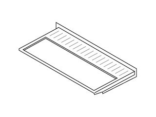{ width="160px" }
#### 815-1092 - Bezel, Floppy
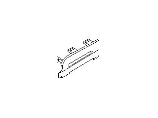{ width="160px" }
#### 815-1093 - Spacer, Keyboard
#### 815-1098 - Cover, Clutch
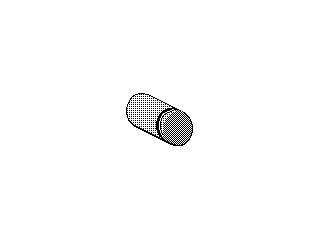{ width="160px" }
#### 815-1108 - Cover, Center Pivot
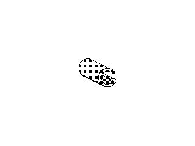{ width="160px" }
#### 815-1109 - Retainer, Clutch
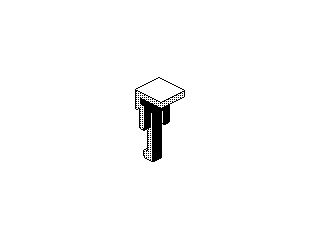{ width="160px" }
#### 815-1110 - Retainer, Floppy
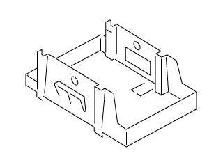{ width="160px" }
#### 815-1111 - Modem Cap
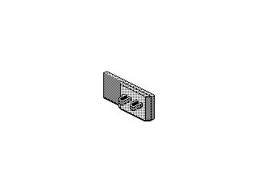{ width="160px" }
#### 815-1113 - Bezel, Standard
#### 844-0018 - Screw, FDHD Superdrive (replaced by [922-3159](#922-3159---screw-fdhd-superdrive-pkg-of-5))
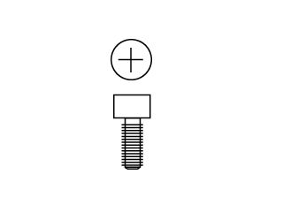{ width="160px" }
#### 865-0054 - Foot, Flat
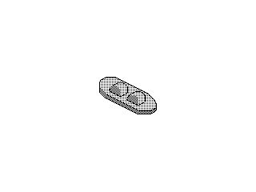{ width="160px" }  
A 3D printed replacement is also available [here](https://www.thingiverse.com/thing:2547630).
#### 865-0060 - Foot, Corner
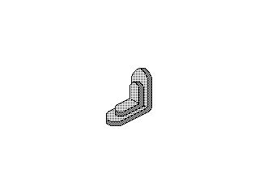{ width="160px" }
#### 865-0068 - Insulator, Battery
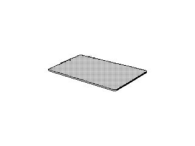{ width="160px" }
#### 922-3159 - Screw, FDHD Superdrive, Pkg. of 5
{ width="160px" }

### Keyboard

#### 076-0226 - Keyswitch Set (10 each), Original Keyboard
#### 076-0377 - Keycap Set, Numeric Keypad
#### 076-0378 - Keycap Set, Numeric Keypad, International Z version
#### 076-0379 - Keycap Set, Numeric Keypad, International PA version
#### 076-0387 - Keyswitch Set, AEK II, Ivory, Pkg. of 10
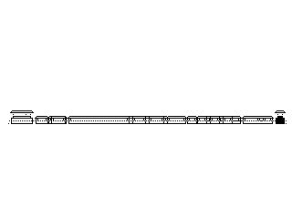{ width="160px" }
#### 658-7136 - Keycap set
#### 661-0476 - Keyboard, Portable
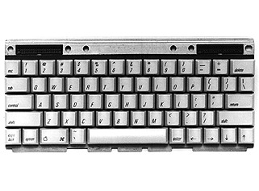{ width="160px" }
#### 661-0477 - Keyboard, Numeric, Original
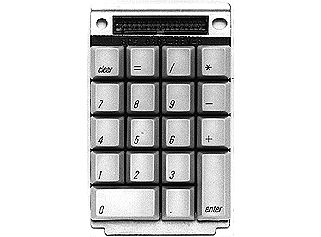{ width="160px" }
#### 661-1611 - Keypad, Numeric, Lightweight
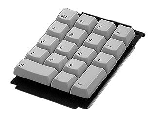{ width="160px" }
#### 661-1612 - Keyboard, Lightweight
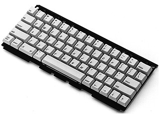{ width="160px" }
#### B661-0476 - Keyboard, Portable, British
#### B661-1612 - Keyboard, British, Lightweight
{ width="160px" }
#### C661-1612 - Keyboard, French Canadian, Lightweight
{ width="160px" }
#### D661-0476 - Keyboard, German, Original Portable
{ width="160px" }
#### D661-1612 - Keyboard, German, Lightweight
#### E661-0476 - Keyboard, Spanish, Original Portable
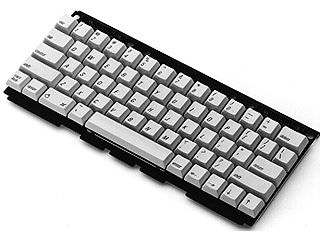{ width="160px" }
#### E661-1612 - Keyboard, Spanish, Lightweight
#### F661-0476 - Keyboard, French, Original Portable
{ width="160px" }
#### F661-1612 - Keyboard, French, Lightweight
#### PA661-0477 - Keypad, Numeric, International PA version, Original
#### PA661-1611 - Keypad, Numeric, International PA Version, Lightweight
#### S661-0476 - Keyboard, Swedish, Original Portable
{ width="160px" }
#### S661-1612 - Keyboard, Swedish, Lightweight
#### T661-0476 - Keyboard, Italian, Original Portable
{ width="160px" }
#### T661-1612 - Keyboard, Italian, Lightweight
#### Z661-0477 - Keypad, Numeric, International Z Version, Original Portable
{ width="160px" }
#### Z661-1611 - Keypad, Numeric, International Z Version, Lightweight
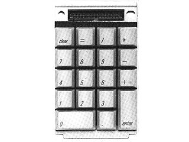{ width="160px" }

### Other/Unsorted

#### 076-0376 - Battery Pack, 6 V
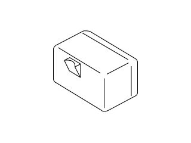{ width="160px" }

#### 600-0406 - Speaker
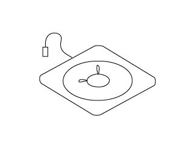{ width="160px" }

#### 630-6386 - Battery Recharger, External
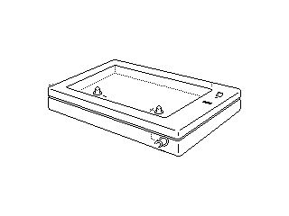{ width="160px" }

#### 661-0473 - Display, LCD, Nonbacklit
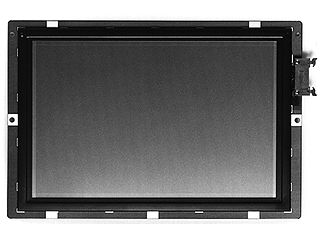{ width="160px" }

#### 661-0474 - Floppy Drive, Apple SuperDrive, 1.4 MB
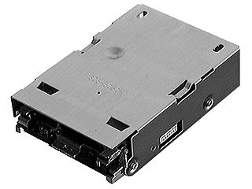{ width="160px" }

#### 661-0475 - Trackball Assembly
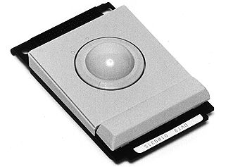{ width="160px" }

#### 661-0540 - Hard Drive, 40 MB, SCSI, 3.5”, Low Power
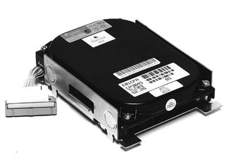{ width="160px" }

#### 661-0585 - Mouse, Apple Desktop Bus
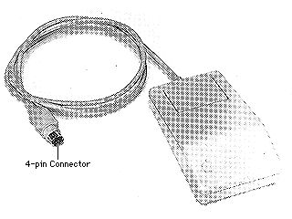{ width="160px" }

#### 661-0647 - Display, LCD, Backlit
{ width="160px" }

#### 699-0142 - Luggage Tag, Original, Pkg. of 2

#### 699-0155 - Luggage Tag, Lightweight

#### 699-0505 - Power Adapter / Charger
{ width="160px" }

#### 805-0970 - Connector, Battery

#### 815-1133 - Ball, Trackball
{ width="160px" }

#### 815-1134 - Retainer, Trackball
{ width="160px" }

#### 922-2733 - Mouse II, Apple Desktop Bus, Rev. B
{ width="160px" }

#### B699-0505 - Power Adapter / Charger, UK

#### JA699-0505 - Power Adapter / Charger, Japan

#### X699-0505 - Power Adapter / Charger, Australia

#### Z699-0505 - Power Adapter / Charger, 220 Euro
