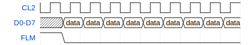

## Signal Descriptions
| Signal | Description | Availability |
| --- | --- | --- |
| D0:7 | 8-bit parallel video data bus. Each bit represents one pixel. | Internal & External |
| M | New frame clock (FLM) divided by 2. Prevents ghosting by switching LCD polarity. Approximately 30Hz. | Internal |
| CL1 | End of line clock. Marks the end of a 80 byte/640 pixel line. | Internal |
| CL2 | Video byte clock. Signals that a new 8 bits of video data is available. | Internal & External |
| FLM | New frame clock. Approximately 60Hz. | Internal & External |
| DISP_BLANK | Turns off the display. | Internal |
| Contrast | Contrast potentiometer control. | Internal (M5120 Only) |
| Brightness | Brightness potentiometer control. | Internal (M5126 Only) |
| Battery Voltage | For monitoring the battery voltage. | External |

Pixels are sent in a "Most Significant Bit" first order on the 8-bit parallel bus. In a line of 8 pixels, bit 7 is the leftmost pixel and bit 0 is the rightmost.

## Examples

## Connector Pinouts

### M5120 Internal Connector Pinout: 

| Pin | Description |
| --- | --- |
| 1 | GND |
| 2 | D7 |
| 3 | D6 |
| 4 | GND |
| 5 | D5 |
| 6 | D4 |
| 7 | GND |
| 8 | D3 |
| 9 | D2 |
| 10 | GND |
| 11 | D1 |
| 12 | D0 |
| 13 | GND |
| 14 |
| 15 | GND |
| 16 | CL2 |
| 17 | CL1 |
| 18 | GND |
| 19 | FLM |
| 20 | M |
| 21 | GND |
| 22 | VCC |
| 23 | VCC |
| 24 | VCC |
| 25 | DISP_BLANK |
| 26 | Contrast |

### M5126 Internal Connector Pinout: 

| Pin | Description |
| --- | --- |
| 1 | D7 |
| 2 | D6 |
| 3 | GND |
| 4 | D5 |
| 5 | D4 |
| 6 | GND |
| 7 | D3 |
| 8 | D2 |
| 9 | GND |
| 10 | D1 |
| 11 | D0 |
| 12 | GND |
| 13 | CL2 |
| 14 | CL1 |
| 15 | GND |
| 16 | FLM |
| 17 | M |
| 18 | GND |
| 19 | |
| 20 | |
| 21 | DISP_BLANK |
| 22 | 
| 23 | 
| 24 | GND |
| 25 | GND |
| 26 | GND |
| 27 | Brightness |
| 28 | 
| 29 | 
| 30 | 
| 31 | VCC |
| 32 | VCC |
| 33 | 
| 34 | 

### External Video Connector
| Pin | Description |
| --- | --- |
| 1 | D0 |
| 2 | D1 |
| 3 | VCC |
| 4 | D2 |
| 5 | D3 |
| 6 | D4 |
| 7 | GND |
| 8 | VCC |
| 9 | GND |
| 10 | D5 |
| 11 | D6 |
| 12 | D7 |
| 13 | Battery Voltage |
| 14 | FLM |
| 15 | CL2 |
