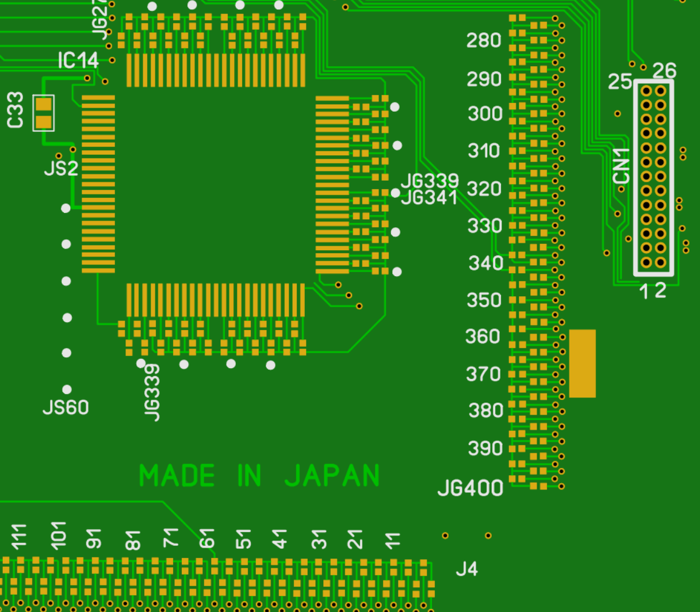

## ScreenTest Utility

This simple HyperCard utility draws a crosshair on the screen and lists the location in X, Y format in the bottom left.

This is useful for determining where bad lines or pixels are on the display.

The center of the crosshair is 1 pixel with 3 pixel gaps.

It's currently very slow and needs to be rewritten at some point.

[Download the utility as a 1.44MB floppy image](files/ScreenTest.img.zip)

## LCD Connection Patching

The pictured pads on the right ending in JG400 are for connections to even numbered lines on the screen. On the opposite end of the board, the driver IC also has pads labeled through JG400. 