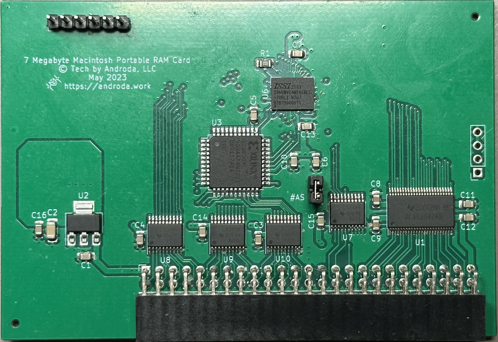
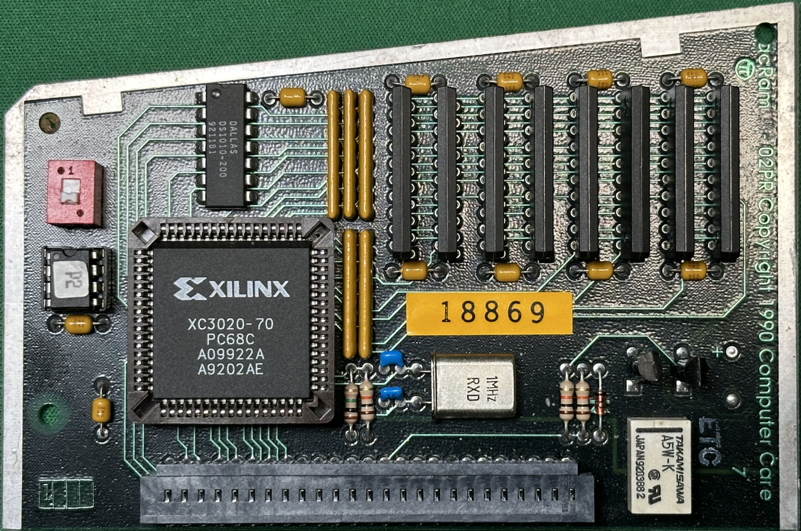
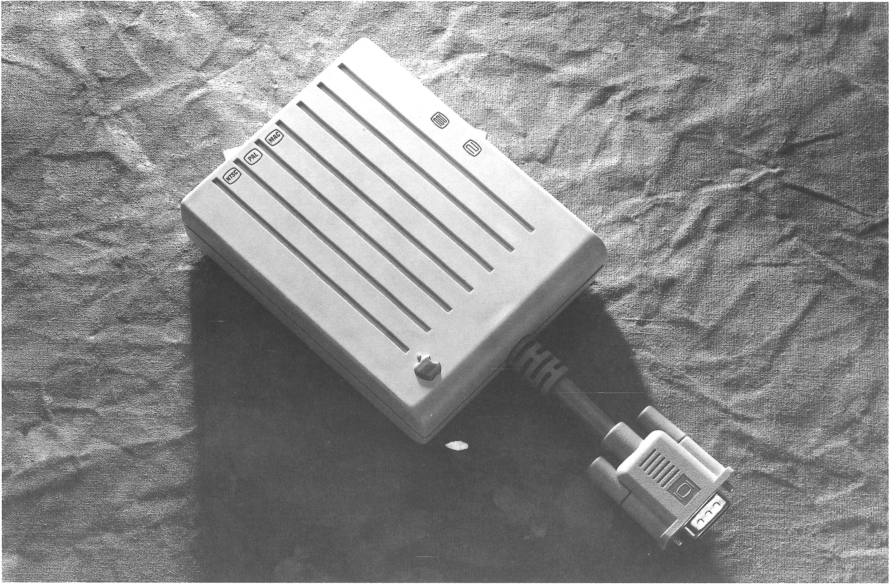
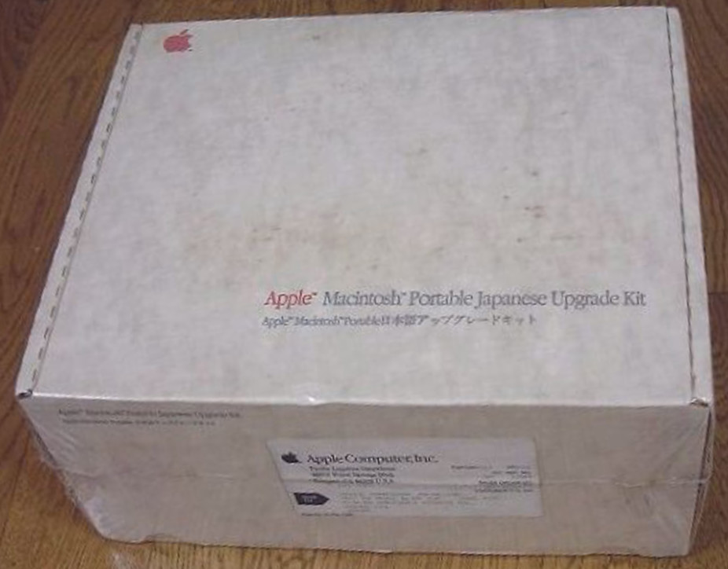

## RAM Cards
### RAM Slot Cards

#### Androda's 7MB RAM Card
{ width="15%"}

[https://androda.work/product/macintosh-portable-7-megabyte-ram-card/](https://androda.work/product/macintosh-portable-7-megabyte-ram-card/)

This 7MB RAM card is a modern design using PSRAM.

#### Apple 1MB SRAM 630-4176

#### Apple PSRAM 1MB/3MB 820-0662-01

This card was most commonly found with the Model M5126 Backlit Macintosh Portable.

The same board is used for both the 1MB and 3MB variants, just with less PSRAM populated.

#### Applied Engineering MacRam Portable

This card was expandable up to 8MB in size using 1MB SIPP SRAM modules.

#### Computer Care PacRam
{ width="15%" }

This 4MB card uses DRAM rather than SRAM or PSRAM.

#### MacEffects 8MB RAM Card

[https://maceffects.com/products/8mb-memory-upgrade-for-macintosh-portable-m5120-m5126](https://maceffects.com/products/8mb-memory-upgrade-for-macintosh-portable-m5120-m5126)

#### Kingston 1MB/3MB/4MB

Model: KTA-1000/MP (1MB), KTA-3000/MP or KTA-4000/MP (4MB)

The same board is used for the 1MB, 3MB, and 4MB variants.

#### Shadow PortaRam

A 1MB RAM card that could be upgraded all the way to 8MB with stacking modules.

### PDS RAM Cards

#### New NoBL PDS Card

Coming Soon

#### PSI

This card is expandable up to 8MB using stacking add-on boards.

## Video Adapters

### Apple Macintosh Portable Video Adapter (Cancelled)

{ width="15%" }

The codename for this adapter or video output capability on the Portable appears to have been "Topanga".

### Computer Care VideoMacPac
The VideoMacPac was a video card that went in the PDS slot and allowed a second screen, unlike the regular video output on the Portable that mirrored the internal display.

It appears to be heavily based off the Lapis DisplayServer based on the code.

Also see the clone of this card, [VideoMacPacHack](https://github.com/apmcpherson/VideoMacPacHack/).

### Generation Systems Portable Publisher
Generation Systems/Generation X Technologies

### Sayett Technology DataShow HR/MP
This video adapter was designed to be used with an overhead projector and plugged directly into the Portable's video output.

### nView Macintosh Portable Adapter

### "New Portable Video Adapter"
Coming soon

## Storage

### MicroNet Pi-40p and Pi-80p

## Modems

### Apple Portable Data Modem 2400 630-4175

### Apple Portable International Modem

### Applied Engineering DataLink/Mac Portable

### Doradus 2400/1200 Modem for 3270

### Megahertz EasyTalk MNP5

### Orchid Technology OrchidFAX LTs

### Prometheus Products TravelModem

### PSI COMplete FAX/Modem

### Xecom NewPort MP 2400

### Xecom NewPort MP 2400mnp5

### Xecom NewPort MP FAX/Data

## Other Hardware

### 3D Printed Battery Case

A 3D printed battery case designed to fit a 6V LiFePO4 battery.

### Androda's Macintosh Portable Battery Eliminator

[https://androda.work/product/macintosh-portable-battery-eliminator/](https://androda.work/product/macintosh-portable-battery-eliminator/)

### Apple Numpad Module

### Apple Backlight Upgrade

### Apple ROM Card AP1234-02

### Second Wave ExpanSE Home BaSE
{ width="15%" }

This expansion system allowed the Portable to be "docked" and connected to an external chassis containing two SE PDS slots.

### Apple Battery Charger

### Apple Macintosh Portable Japanese Upgrade Kit

{ width="15%" data-title="The Japanese Upgrade Kit, in box" data-description="Source: Yahoo Auctions Japan" }

Alternate Name: Apple Macintosh Portable 日本語アップグレードキット

The contents of this kit are unknown. It's possible it may have contained a [Japanese Keyboard](Components.md#macintosh-portable-japanese-keyboard).

### Creative Solutions ROM Expansion Card

### MicroTouch Mac 'n Touch
This added a touch screen to the Macintosh Portable.

### Lind Electronic Design External Battery Charger

### "Debug ROM Card" (WIP)

### "New Portable Numpad Module" (WIP)

### DTACK Generator Card
