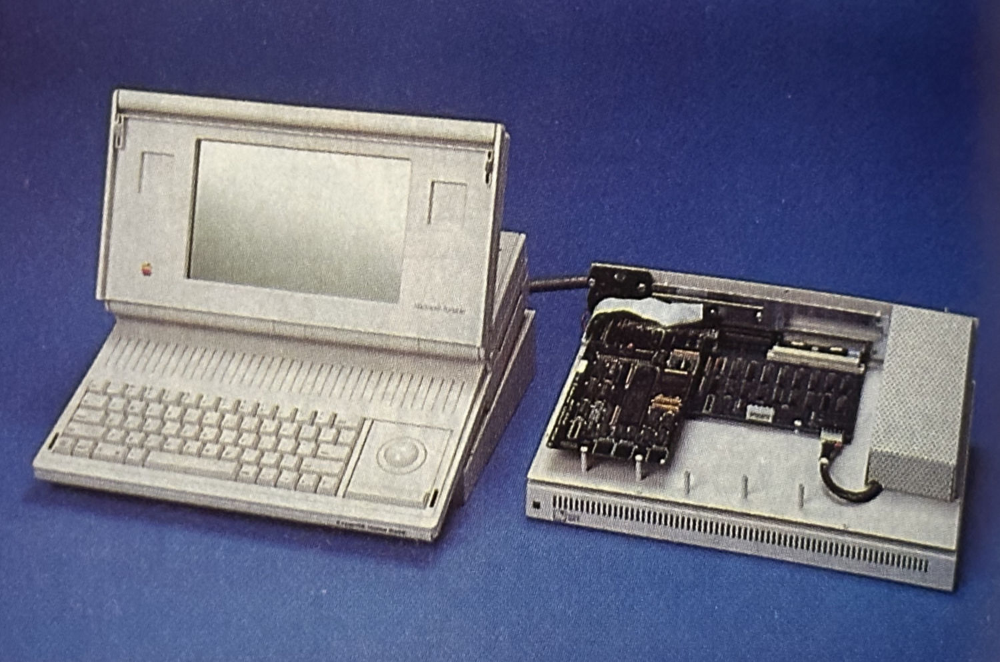

## RAM Cards
### RAM Slot Cards

#### Apple 1MB SRAM 630-4176

#### Apple PSRAM 1MB/3MB 820-0662-01

#### Applied Engineering MacRam Portable

This card was expandable up to 8MB in size using 1MB SIPP SRAM modules.

#### Computer Care PacRam
This 4MB card uses DRAM rather than SRAM.

#### MacEffects 8MB RAM Card

#### Kingston 1MB/4MB

Model: KTA-1000/MP (1MB) or KTA-4000/MP (4MB)

### PDS RAM Cards

#### PSI

## Video Adapters

### Apple Macintosh Portable Video Adapter (Cancelled)

### Computer Care VideoMacPac

### Generation Systems Portable Publisher
Generation Systems/Generation X Technologies

### Sayett Technology DataShow HR/MP
This video adapter was designed to be used with an overhead projector and plugged directly into the Portable's video output.

### nView Macintosh Portable Adapter

### "New Portable Video Adapter"
Coming soon

## Storage

### MicroNet Pi-40p and Pi-80p

## Modems

### Apple Portable Data Modem 2400 630-4175

### Apple Portable International Modem

### Applied Engineering DataLink/Mac Portable

### Doradus 2400/1200 Modem for 3270

### Megahertz EasyTalk MNP5

### Orchid Technology OrchidFAX LTs

### Prometheus Products TravelModem

### PSI COMplete FAX/Modem

### Xecom NewPort MP 2400

### Xecom NewPort MP 2400mnp5

### Xecom NewPort MP FAX/Data

## Other Hardware

### DTACK Generator Card

### Apple Numpad Module

### Apple Backlight Upgrade

### Apple ROM Card AP1234-02

### Debug ROM Card
Coming soon  
[https://github.com/rezafouladian/MacintoshPortableTestROM](https://github.com/rezafouladian/MacintoshPortableTestROM)

### "New Portable Numpad Module"

### Second Wave ExpanSE Home BaSE
This expansion system allowed the Portable to be "docked" and connected to an external chassis containing two SE PDS slots.

??? note "Image"
    

### Apple Battery Charger

### Creative Solutions ROM Expansion Card

### MicroTouch Mac 'n Touch
This added a touch screen to the Macintosh Portable.

### Lind Electronic Design External Battery Charger