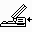

# Slim Cards

"Slim Cards" are a piece of hardware that it appears Apple was designing for the Macintosh Portable but I'm unsure whether they ever existed.

This likely would have been two slots above the floppy drive, likely taking the place of the hard drive.

These card slots would be connected to an adapter in the PDS slot.

The cards would have been some form of non-volatile storage, such as flash memory or ROM, and would be directly mapped into the upper 4MB of RAM space from `0x500000` to `0x8FFFFF`.  
They could be up to 2MB in size and were sized in 512KB segments. Slim card 0 would map to `0x500000` up to `0x6FFFFF`, and slim card 2 would map from `0x700000` up to `0x8FFFFF`.

The maximum amount of RAM that can be installed with a slim card adapter installed is 5MB. The memory sizing routine checks the register at `0xFC0200` for bit 3, and only sizes up to 5MB if detected.

The cards could be inserted and ejected while the OS is running, unlike ROM disks.

## Slim Card Registers

| Location | Description |
| --- | --- |
| 0xF00000 | Bit 3: Slim 0 inserted  Bit 2: Slim 0 is ROM or write protected |
| 0xF00010 | Bit 3: Slim 0 eject register (0 to eject) |
| 0xF00020 | Bit 3: Slim 0 write protect |
| 0xF00030 | Bit 3: Slim 1 inserted  Bit 2: Slim 1 is ROM or write protected |
| 0xF00040 | Bit 3: Slim 1 eject register (0 to eject) |
| 0xF00050 | Bit 3: Slim 1 write protect |
| 0xFC0200 | Bit 3: Slim adapter installed |

## Slim Adapter ROM

The slim card adapter has the ability to execute code from additional ROM. If bit 3 of `0xFC0200` is high indicating that a slim card adapter is installed, `0xE00000` is checked to see if it contains `SLIM ROM`. If it does, code is executed from `0xE00008`.