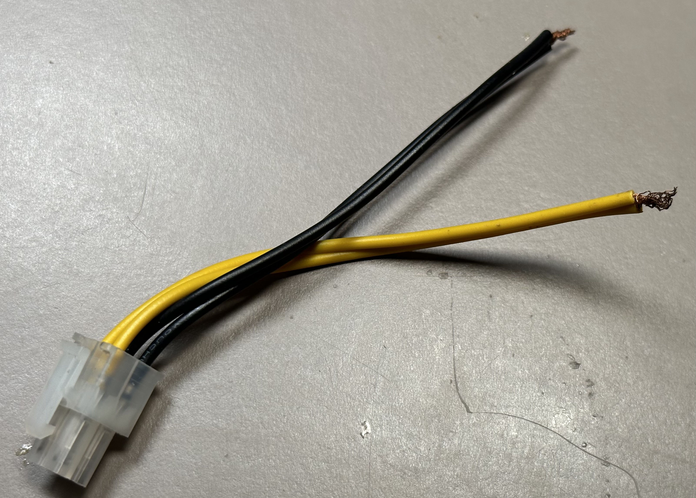
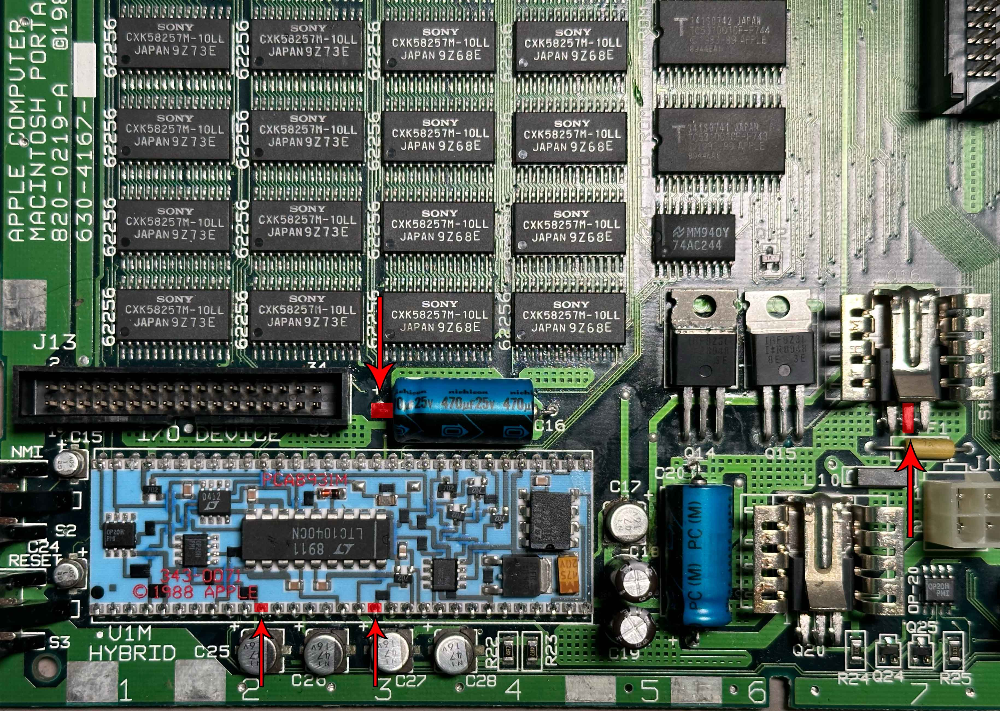
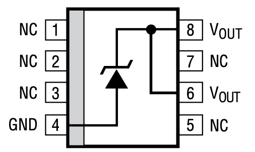
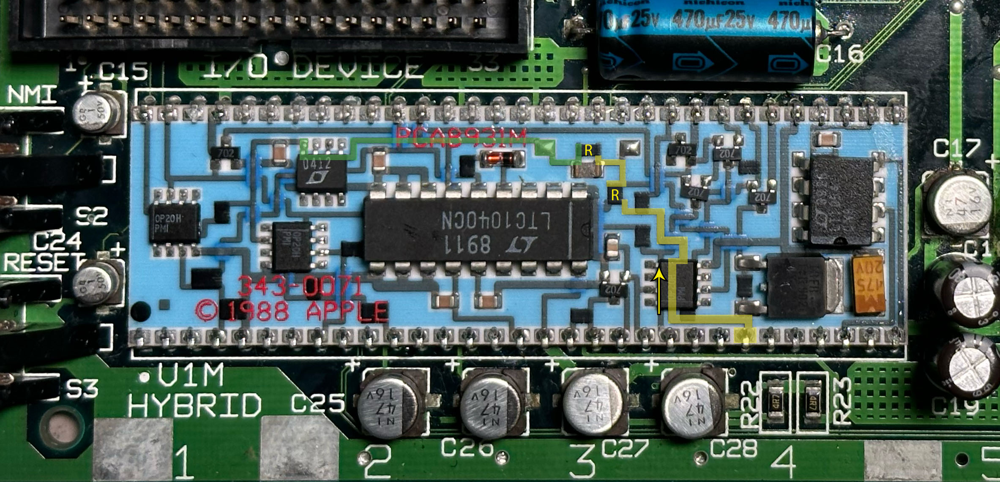

# Testing and Troubleshooting Guide

## Test Setup

### Powering the Logic Board

When powering the logic board, you must go through the main battery connector and ensure both positive (+) pins are connected to the power source.

Powering the board though the DC power jack used for charging will not work properly.

### A good power source

If using a variable power supply, you will want to start at a low voltage.  
It's possible when certain components fail that it will send the voltage level of the battery to components only designed to take +5V. The ADC in the power manager is known to be damaged by high voltages.

Ideally you should be at a voltage that is as low as possible but not so low that the hybrid cuts off power. The minimum is around 5.4V, but for testing purposes a good place to start is 6.0V.

For the current limit, a good value while the computer is "powered off" is 500mA.  
If turning the computer on, you will need at least 1A if nothing else is connected, and likely around 3A if other accessories such as hard drive, floppy drive, and RAM card are connected.

Using a battery is not recommended when the computer is in an unknown state, due to both the potential for damage mentioned above as well as adding another point of failure.  

If you do choose to use a battery for initial testing, make sure your battery is good and check it often. If your battery isn't strong enough to power the computer or runs down, you may be lead to believe something is wrong with the logic board when it's actually just the battery.

#### Using the 4-pin connector
One easy way is to cut the 4-pin CPU Power cable from an ATX power supply (do not use it straight from the ATX power supply as it will supply +12V!).

You can also buy 4-pin CPU Power extensions and use the male end.

If you are building your own cable, 4-pin (2x2) Molex Mini-Fit Jr. or TE VAL-U-LOK connector should work.

{ width="25%" }

The top two pins by the clip (yellow in this picture) are the positive (+) pins, and the bottom two (black in this picture) are the negative (-) pins.

#### Through the battery box
You can clip onto the contacts inside the battery box to supply power.

In order for this to work, you will need to make sure the battery lid switch remains depressed (either with the original lid or with other methods) as well as verifying that the switch is working as they can sometimes go bad.

If you can't remember which side is positive (+) and which is negative (-), remember that the silver paint is conductive and connected to the negative (-), and the positive (+) terminal inside the battery box does not have paint around it.

#### Clipping onto the board

It is possible to power the board by clipping a positive (+) lead onto the fuse and a negative (-) onto the negative leg of a capacitor or another ground plane. You will need to find a way to bridge the two positive pins of the battery connector, such as soldering a wire across them on the bottom of the board.

## Powered Off Testing

### Always-on +5V

There are many places to check the always-on +5V from, such as:

1. Pin 2 of Q16, or the heatsink attached to Q16
    - There's a chance of poor connectivity between the heatsink and the body of Q16, so if you see a strange reading, try testing from another point
1. The positive leg of C16
1. Pins 11 and 18 of the hybrid

Here is an image highlighting those points:

{ width="160px" }

The +5V is typically around 5.2V, but anywhere between 5.0-5.3V should probably be fine.

### Battery Level (A/D)

The A/D line is connected to pin 62 on the hybrid.

The A/D circuitry on the hybrid converts the battery's normal voltage range of 5.4V-7.5V into a 0V-5V range for the ADC on the Power Manager.

An example of the circuit in action is [here](https://www.falstad.com/circuit/circuitjs.html?ctz=CQAgjCAMB0l3BWcMBMcUHYMGZIA4UA2ATmIxAUgoqoQFMBaMMAKAEMKU8RtDvD8PPiGLgkTJGHjxw0QigQIALL3klsynLPmLi2bErAIShDChTJpLAO4gB3XvyVVHUG3edCnVJUu6QWACcPHz8KARBffxA8JUo4IMi8H2Sk2l8oS3gWACU0igy-WmILKh8qMGgUbEyy6AR3Y1DuIsiwgNtWrtSot06esNbsWL784aVOBxGAtHJcCY0LBUIeBAsJgCE2ABdtukCAT0T51YtF08zeK2Dz8+cXNcywbAwA4PuLj8MViukAgHNInBImAVl92qMPuc1g5HgE8q5QS5hMxSplPBh6rUoPUWLMvOAIoiSpEQFtdvsjrZCJ5XGZkdwUCxhoSQAAxCC0ECY8QQABqAHsADbbNj-OgsIA).

When the battery voltage is around 7.5V (fully charged with charger connected) the A/D line will output 5.0V.  
When battery approaches the low battery shutdown point at around 5.6V, the A/D line will output around 1.0V.

This should never be above 5V, and the Power Manager's ADC pin lists an absolute maximum rating of VCC+0.3V, so typically around 5.5V. Damage may occur if this is exceeded.

## Powered On Testing

### Powered-on +5V

### +12V

### -5V

## Troubleshooting

### Always-on +5V Troubleshooting

#### No voltage

1. Check Fuse

1. Low Voltage Comparator

#### Incorrect voltage

1. Check 1.2V Reference

### 1.2V Reference Troubleshooting

The 1.2V reference provides a reference voltage for several key parts of voltage regulation.

This is provided by a Linear Technology LT1004-1.2. The IC is marked "0412" and is located on the hybrid module.

{ width="160px" }

The reference needs a small amount of current to create the reference voltage, typically around 8µA at the minimum. 

Here is an image highlighting current supply path for the reference. Highlighted in yellow is the supply from the battery, through two resistors. After the second resistor the voltage should be 1.2V, highlighted in green.

{ width="160px" }

If you believe the reference is not getting enough current, you can try adding a resistor (recommended size between 100kΩ and 200kΩ) to supply more current.  
Be careful not to supply too much current, as the reference will have to dissipate that as heat.

### Low Voltage Comparator Troubleshooting

### A/D Battery Meter Troubleshooting

### Display Troubleshooting

#### Missing Lines
