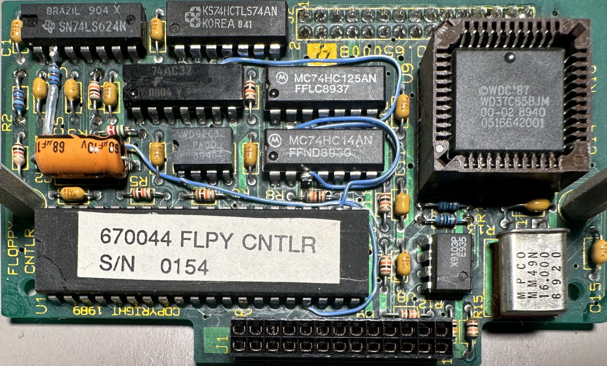

## Internal Floppy

The PCB in the Citizen U0DA-07A appears to have the part number C70-1070.

### Components

| Designator | Type | Value |
| --- | --- | --- |
| C35 | Capacitor, Electrolytic SMD | 2.2uF 35V |
| C39 | Capacitor, Electrolytic SMD | 10uF 16V |
| C101 | Capacitor, Electrolytic SMD | 22uF 16V |
| C102 | Capacitor, Electrolytic SMD | 22uF 16V |
| R36 | Resistor | 330Ω |
| R67 | Resistor | 1kΩ |
| IC2 | | TC8615F-003 |
| IC4 | DC Motor Controller/Driver | AN8235S |

### Connector

| Pin | Signal | \| | Pin | Signal |
| --- | --- | --- | --- | --- |
| 1 | VCC | \| | 2 | /INDEX |
| 3 | VCC | \| | 4 | /SEL |
| 5 | VCC | \| | 6 | /DSKCHG |
| 7 | VCC | \| | 8 |  |
| 9 | | \| | 10 | /MOT |
| 11 | | \| | 12 | /DIR |
| 13 | GND | \| | 14 | /STEP |
| 15 | GND | \| | 16 | /WDATA |
| 17 | GND | \| | 18 | /WGATE |
| 19 | GND | \| | 20 | /TRACK0 |
| 21 | GND | \| | 22 | /WPROTECT |
| 23 | GND | \| | 24 | /RDATA |
| 25 | GND | \| | 26 | /SIDE |

## Internal Floppy Interposer

{ width="50%" }

### Components

| Designator | Type | Value |
| --- | --- | --- |
| | Serial Communications Controller | 85C30 |
| | Floppy Data Seperator | WD92C32 |
| | Potentiometer | X9103P |
| | Floppy Controller | WD37C65 |
| | OR Gate | 74AC32 |
| | Voltage Controled Oscillator | 74LS624 |
| | Hex Inverter | 74HC14 |
| | Dual D-type Flip-flop | 74HCT74 |
| | Capacitor, Electrolytic Axial | 68uF 10V |