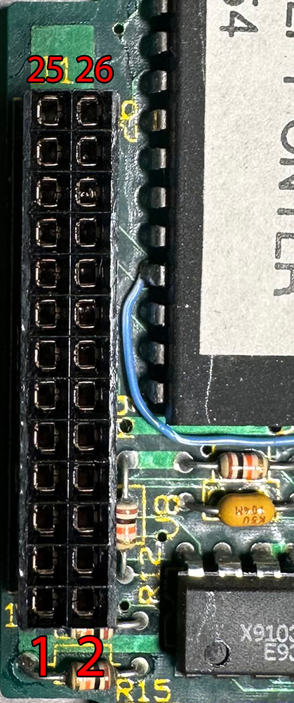

# Outbound Floppy Drives

The Outbound 125 supported either an internal floppy drive or an internal hard drive. You could only have one or the other, and the EEPROM only included code for one at a time.

There was also an external floppy drive available that connected using the host connector, and when using the host cable with a Macintosh Plus or Macintosh SE you could utilize the internal floppy drive there.

The internal floppy drive version of the EEPROM included a driver called `.Super` to add support for the drive to the system.

## Internal Floppy

{ width="15%" } { width="14.7%" }

The PCB in the Citizen U0DA-07A appears to have the part number C70-1070.

The drive is a "Slim" 3.5" drive, measuring around 19.5mm x 101.5mm x 134mm.

### Floppy Drive Issues

This model of Citizen drive has issues with the drive belt disintegrating as well as the electrolytic capacitors leaking.

For the belt I ended up using a 3mm wide flat belt out of an assortment of 3mm wide belt sizes purchased from Amazon. I don't know the exact size of the belt I used but I estmate the length is probably around 260mm.

The four electrolytic capacitors (C35, C39, C101, C102) will need to be replaced as they have likely leaked.

### Components

| Designator | Type | Value |
| --- | --- | --- |
| C35 | Capacitor, Electrolytic SMD | 2.2uF 35V |
| C39 | Capacitor, Electrolytic SMD | 10uF 16V |
| C101 | Capacitor, Electrolytic SMD | 22uF 16V |
| C102 | Capacitor, Electrolytic SMD | 22uF 16V |
| R36 | Resistor | 330Ω |
| R67 | Resistor | 1kΩ |
| IC2 | | TC8615F-003 |
| IC4 | DC Motor Controller/Driver | AN8235S |

### Connector

{ width="20%" data-title="The connector on the floppy drive" } { width="17%" data-title="The connector on the floppy interposer"}

| Pin | Signal | \| | Pin | Signal |
| --- | --- | --- | --- | --- |
| 1 | VCC | \| | 2 | /INDEX |
| 3 | VCC | \| | 4 | /SEL |
| 5 | VCC | \| | 6 | /DSKCHG |
| 7 | VCC | \| | 8 |  |
| 9 | | \| | 10 | /MOT |
| 11 | | \| | 12 | /DIR |
| 13 | GND | \| | 14 | /STEP |
| 15 | GND | \| | 16 | /WDATA |
| 17 | GND | \| | 18 | /WGATE |
| 19 | GND | \| | 20 | /TRACK0 |
| 21 | GND | \| | 22 | /WPROTECT |
| 23 | GND | \| | 24 | /RDATA |
| 25 | GND | \| | 26 | /SIDE |

## Internal Floppy Interposer

{ width="50%" }

### Components

| Designator | Type | Value |
| --- | --- | --- |
| | Serial Communications Controller | 85C30 |
| | Floppy Data Seperator | WD92C32 |
| | Potentiometer | X9103P |
| | Floppy Controller | WD37C65 |
| | OR Gate | 74AC32 |
| | Voltage Controled Oscillator | 74LS624 |
| | Hex Inverter | 74HC14 |
| | Dual D-type Flip-flop | 74HCT74 |
| | Capacitor, Electrolytic Axial | 68uF 10V |

## External Floppy

An external floppy drive option was also available which utilized the Outbound's "host" port.
